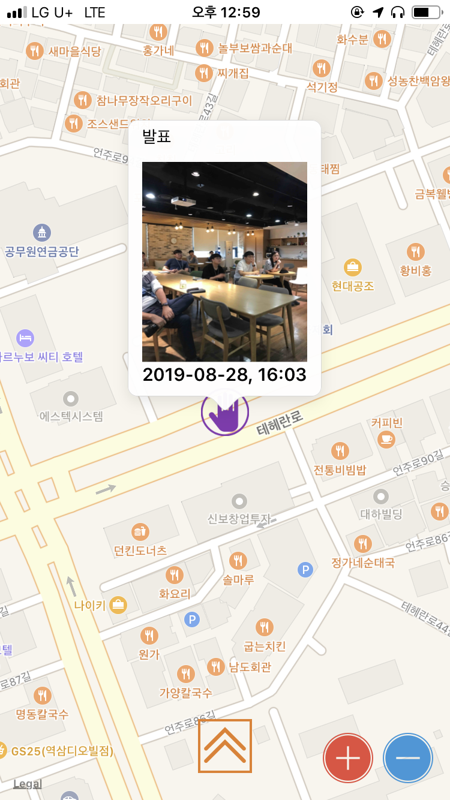

# SWIFT 적응을 위한 토이프로젝트

Swift 활용능력을 향상하기 위해 진행하고 있는 개인 미니프로젝트입니다.
MapView를 기반으로 자신이 현재 위치한 포인트에서만 사진촬영을 통해 그 순간의 사진메모를 남기는 어플리케이션 입니다.

### 사용 기술 스택
- Firabase Spark(Auth/Storage/RealtimeDataBase)
- Swift/PromiseKit/RxSwift/SnapKit

### 개발 블로그
- [MapView 셋팅1](https://jhmdevdiary.tistory.com/1?category=761518)
- [MapView 셋팅2](https://jhmdevdiary.tistory.com/8?category=761518)
- [FireBase 활용](https://jhmdevdiary.tistory.com/6?category=761520)
- [PromiseKit 적용기](https://jhmdevdiary.tistory.com/7?category=761519)
- [RxSwift 적용기](https://jhmdevdiary.tistory.com/11?category=761519)

### 결과물(이미지)

